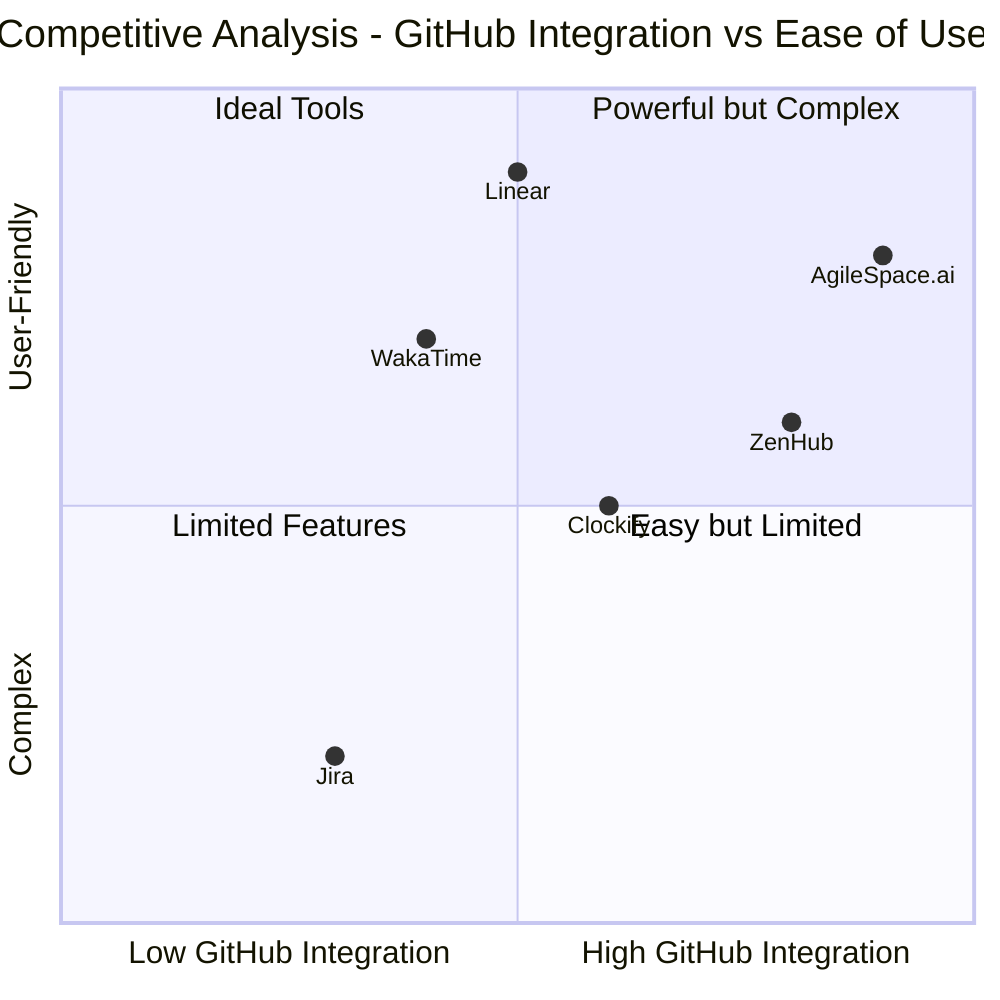

# Product Requirements Document: AgileSpace.ai

## 1. Project Overview

### 1.1 Introduction
AgileSpace.ai is an AI-powered platform designed to streamline project management and time tracking for product development teams, featuring deep GitHub integration. The platform aims to provide a seamless experience for product owners to manage their teams and track work sessions directly within their GitHub workflow.

### 1.2 Original Requirements
Product Name: AgileSpace
Target Users: Product owners managing product development teams
Primary Goal: Facilitate collaboration and effective team/product management with deep GitHub integration

### 1.3 Product Goals
1. Seamlessly integrate with GitHub to provide a unified workflow for development teams
2. Streamline work session tracking and time management with minimal context switching
3. Enhance team collaboration through real-time session tracking and note-sharing

## 2. User Stories

### 2.1 Core User Stories
1. As a product owner, I want to authenticate with my GitHub account so that I can access my organization's repositories and start managing my team.
2. As a team leader, I want to track work sessions for specific GitHub issues so that I can monitor time spent on different tasks.
3. As a developer, I want to quickly find and start tracking time on my assigned GitHub issues so that I can maintain accurate time records.
4. As a product owner, I want to see who is working on what issues in real-time so that I can better coordinate team efforts.
5. As a team member, I want to add notes to my work sessions so that I can document important decisions and progress.

## 3. Market Analysis

### 3.1 Competitive Analysis

#### GitHub-Integrated Project Management Tools

1. ZenHub
   - Pros:
     * Direct GitHub integration via browser extension
     * Free tier available
     * Native GitHub-like experience
   - Cons:
     * Performance issues with large projects
     * Limited customization options
     * Basic reporting functionality

2. Linear
   - Pros:
     * Superior speed and performance
     * Excellent UI/UX with native apps
     * Extensive keyboard shortcuts
   - Cons:
     * Limited GitHub integration depth
     * Higher pricing for teams
     * Learning curve for non-technical users

3. Jira
   - Pros:
     * Comprehensive feature set
     * Extensive customization options
     * Robust reporting
   - Cons:
     * Complex setup and maintenance
     * Steep learning curve
     * GitHub integration requires additional setup

4. WakaTime
   - Pros:
     * Automatic time tracking
     * Detailed coding analytics
     * IDE integration
   - Cons:
     * Limited project management features
     * Focus on individual metrics
     * No team collaboration features

5. Clockify
   - Pros:
     * Direct GitHub issue integration
     * Comprehensive time tracking
     * Multiple platform support
   - Cons:
     * Manual time entry required
     * Limited automation
     * Basic GitHub integration

### 3.2 Competitive Quadrant Chart

## 4. Product Specifications

### 4.1 Authentication System
- Priority: P0
- Requirements:
  * Implement GitHub OAuth authentication flow
  * Redirect unauthenticated users to /login
  * Auto-redirect authenticated users to dashboard
  * Store and manage GitHub access tokens securely
  * Handle authentication errors gracefully

### 4.2 Dashboard Layout
- Priority: P0
- Requirements:
  * Implement responsive sidebar with:
    - GitHub organization selector
    - Navigation menu (Repositories, Projects, Teams, People)
    - Footer with Theme Toggle, Logout, Settings
  * Header with Spacier panel toggle
  * Main content area with dynamic routing
  * Persist selected organization across sessions

### 4.3 Spacier Panel
- Priority: P1
- Requirements:
  * Sliding side panel with smooth animation
  * Work session tracking interface:
    - GitHub issue display with truncated title
    - Real-time time tracking
    - Participant management with avatar display
    - Rich text notes editor
  * Session state management
  * Auto-save functionality for notes

### 4.4 Command Modal
- Priority: P1
- Requirements:
  * Global keyboard shortcut (Command + J)
  * Fuzzy search implementation for issues
  * Real-time GitHub API integration
  * Filter toggles:
    - Issue type
    - Assignee
    - Labels
    - Status
  * Quick action buttons for session management

### 4.5 Issue Tracking Workflow
- Priority: P0
- Requirements:
  * Single active session management
  * Real-time session updates
  * Participant management interface
  * Notes system with auto-save
  * Session state persistence
  * GitHub issue status sync

## 5. Technical Requirements

### 5.1 Development Framework
- Base implementation on Midday v1 starter template
- Use ShadCN UI components exclusively
- Follow GitHub design system principles
- Implement responsive design for all viewports

### 5.2 Integration Requirements
- GitHub API v4 (GraphQL) integration
- Real-time updates using WebSocket
- Secure token management
- Rate limiting handling
- Error recovery mechanisms

### 5.3 Performance Requirements
- Initial page load under 2 seconds
- Command modal response under 200ms
- Real-time updates within 500ms
- Smooth animations (60 fps)

## 6. UI Design Requirements

### 6.1 Design System
- Follow GitHub's design system:
  * Typography
  * Color palette
  * Spacing
  * Component styling
- Dark/light theme support
- Consistent spacing and alignment
- Accessible color contrasts

### 6.2 Component Library
- ShadCN UI components:
  * Modals
  * Buttons
  * Forms
  * Cards
  * Navigation
  * Tooltips
  * Alerts

## 7. Open Questions

1. Data Persistence
   - How long should work session history be retained?
   - Should notes be synced with GitHub issue comments?

2. Integration Depth
   - Should the platform support GitHub Actions integration?
   - How should merge requests be handled in the tracking system?

3. Scaling Considerations
   - How should the system handle organizations with 1000+ repositories?
   - What are the rate limiting implications for large teams?

## 8. Success Metrics

### 8.1 User Engagement
- Daily Active Users (DAU)
- Average session duration
- Feature adoption rate
- User retention rate

### 8.2 Performance Metrics
- Page load time
- API response time
- Error rate
- System uptime

### 8.3 Team Productivity
- Time tracking accuracy
- Issue completion rate
- Team collaboration score
- Documentation completeness